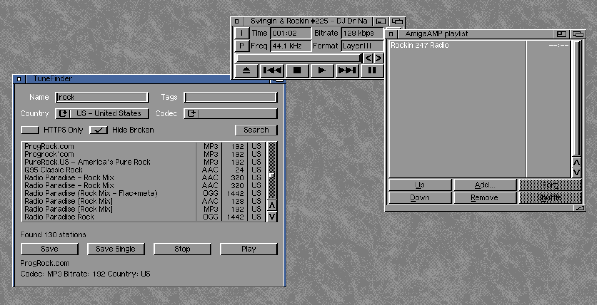

# TuneFinder

TuneFinder is an AmigaOS 3.x application that allows you to browse and save Internet radio stations. It uses the Radio Browser API to search for stations worldwide.

## Features
- Search radio stations by name, country, codec, or tags
- Filter stations by HTTPS and broken links
- Save stations as PLS playlists
- Play stations in AmigaAmp
- Configurable API settings
- Compatible with AmigaOS 3.x (68020+ CPU recommended)
- Support for Amiga translation library

## Requirements
- AmigaOS 3.x
- 68020 CPU or better
- At least 4MB RAM
- Internet connection
- Working TCP/IP stack


## Building

### Prerequisites
If you're cross-compiling on Linux, you need:
- amiga-gcc compiler (bebbo's toolchain) or Docker or sacredbanana/amiga-compiler docker image
- GNU Make
- Amiga NDK 3.2 or sacredbanana/amiga-compiler Docker image

### Build Instructions

1. Standard build (release version):
```bash
make
```
or 
```bash
docker run --rm  -v ${PWD}:/work -it sacredbanana/amiga-compiler:m68k-amigaos make release
```
2. Debug build with additional logging:
```bash
make debug
```
or 
```bash
docker run --rm  -v ${PWD}:/work -it sacredbanana/amiga-compiler:m68k-amigaos make debug
```

3. Clean build files:
```bash
make clean
```
or 
```bash
docker run --rm  -v ${PWD}:/work -it sacredbanana/amiga-compiler:m68k-amigaos make clean
```

The compiled binary will be placed in the `out` directory.

## Translation

To translate TuneFinder to a new language, create a new .ct file with the same structure as shown in [assets/translation](assets/translation/tunefinder.cd) , replacing each English text line with your translated version while keeping the MSG_ identifiers and semicolons untouched. Make sure to update the language code in the header of your .ct file (e.g., ## language deutsch for German). 
After creating your translation file, use the command 

```bash
flexcat tunefinder.cd yourlanguage.ct CATALOG LOCALE:Catalogs/yourlanguage/tunefinder.catalog
```

To use it in the docker 

```bash
docker run --rm  -v ${PWD}:/work -it sacredbanana/amiga-compiler:m68k-amigaos flexcat assets/translation/tunefinder.cd assets/translation/tunefinder_polish.ct CATALOG tunefinder.catalog
```

to generate the catalog file, then place the generated catalog in your LOCALE:Catalogs/yourlanguage/ directory.

## Installation

1. Copy the TuneFinder executable to your Amiga

## Usage

1. Launch TuneFinder
2. Enter search criteria (name, country, codec, or tags)
3. Click "Search" to find stations
4. Select a station to view details
5. Use "Save" to create a PLS playlist file or "Play" to play selected station in the AmigaAmp

## Screenshot



## Credits
Created by sandlbn
